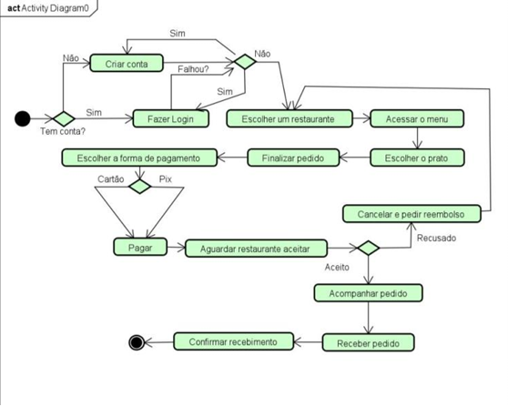

# Sistema Trazja

## Descrição Geral
O Trazja é uma plataforma digital de delivery que orquestra a interação entre Clientes, Restaurantes e Entregadores. O sistema gerencia todo o ciclo de vida de um pedido, desde a sua criação até a entrega final.

## Requisitos Gerais

### Requisitos Funcionais (RF)
| ID | Descrição | Prioridade |
|----|-----------|------------|
| RF01 | O sistema deve permitir que o restaurante adicione novos pratos ao seu menu. | Essencial |
| RF02 | O sistema deve permitir que o cliente monte um pedido, informe o endereço e realize o pagamento. | Essencial |
| RF03 | O sistema deve permitir que o restaurante visualize e aceite ou recuse um novo pedido. | Essencial |
| RF04 | O sistema deve permitir que o cliente acompanhe o status do seu pedido em tempo real. | Essencial |
| RF05 | O sistema deve permitir que um novo cliente se cadastre na plataforma. | Essencial |
| RF06 | O sistema deve notificar entregadores disponíveis sobre um pedido pronto para coleta. | Essencial |
| RF07 | O sistema deve permitir que o entregador sinalize a coleta e a finalização da entrega. | Essencial |

### Requisitos Não Funcionais (RNF)
| ID | Descrição | Categoria | Prioridade |
|----|-----------|-----------|------------|
| RNF01 | O sistema deve processar um pagamento online (Pix ou Cartão) em até 5 segundos. | Desempenho | Essencial |
| RNF02 | Todas as informações sensíveis do usuário (senhas, dados do cartão) devem ser criptografadas. | Segurança | Essencial |
| RNF03 | A interface deve ser intuitiva, permitindo primeiro pedido em menos de 3 minutos. | Usabilidade | Importante |
| RNF04 | O sistema deve estar disponível em 99,5% do tempo, especialmente em horários de pico. | Disponibilidade | Essencial |
| RNF05 | O aplicativo deve ser compatível com as duas últimas versões de Android e iOS. | Compatibilidade | Importante |

### Regras de Negócio (RN)
| ID | Descrição |
|----|-----------|
| RN01 | O restaurante tem um prazo de 5 minutos para aceitar ou recusar um pedido. |
| RN02 | O pagamento só pode ser realizado via Pix ou Cartão de Crédito/Débito. |
| RN03 | Um entregador deve estar com status "online" para receber solicitações. |
| RN04 | O sistema busca entregador automaticamente quando o pedido estiver "Pronto para Coleta". |
| RN05 | O valor do frete é calculado com base na distância entre restaurante e cliente. |

## Diagramas UML
### Diagrama de caso de uso

### Diagrama de sequência
Sequência de fluxo de entrega

### Diagrama de atividade
Diagrana de atividade fazer pedido

## Arquitetura do Sistema
O sistema **TrazJá** foi projetado seguindo o padrão arquitetural **MVC (Model-View-Controller)**, que separa a aplicação em três camadas lógicas para facilitar a manutenção e escalabilidade:

* **Model (Modelo):** Responsável pela estrutura de dados e regras de negócios.
    * Gerencia as entidades principais como *Cliente, Restaurante, Entregador e Pedido*.
    * Garante a integridade e segurança dos dados, incluindo a criptografia de informações sensíveis (conforme **RNF02** e **RSW01**)
    * Realiza a persistência das informações no Banco de Dados.

* **View (Visão):** Responsável pela interface com o usuário.
    * Apresenta as telas do aplicativo compatíveis com **Android e iOS** (conforme **RNF05**)
    * Exibe o status do pedido em tempo real e os formulários de cadastro.
    * É a camada que interage diretamente com o Cliente, Entregador e Restaurante.

* **Controller (Controlador):** Responsável por intermediar a comunicação entre a View e o Model.
    * Processa as requisições, como o cálculo automático de frete baseado na distância (conforme **RSW07**) e a validação de pagamentos em até 5 segundos (conforme **RNF01**)
    * Gerencia o fluxo de notificações automáticas entre os usuários (conforme **RSW06**)